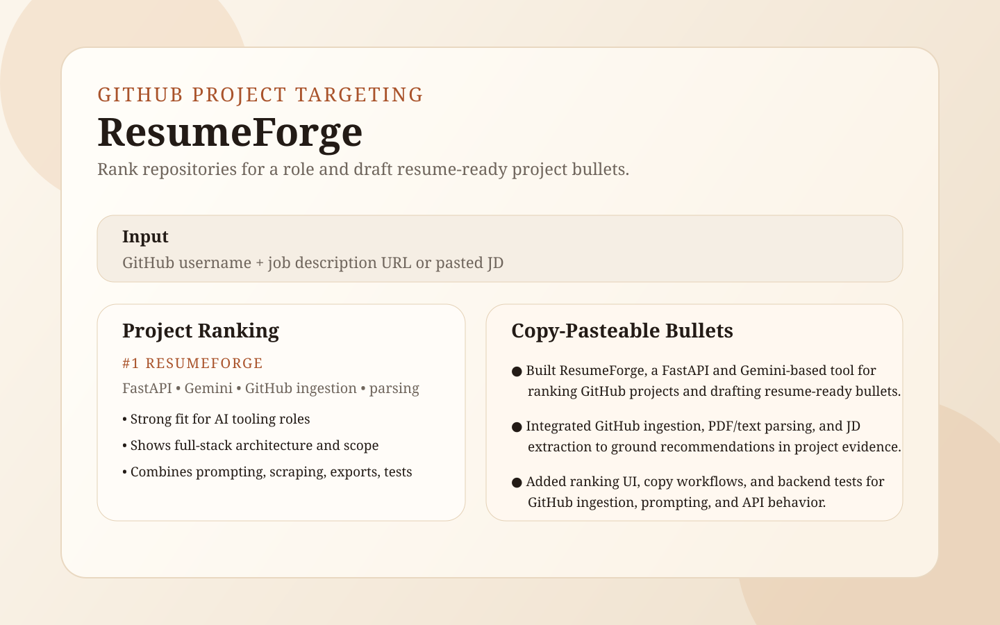

# ResumeForge

ResumeForge helps you turn GitHub projects into stronger resume content.



Live Demo: currently local-only. Run the backend and frontend with the included scripts, then open `http://127.0.0.1:4173`.

## What It Does

ResumeForge is built for the moment before you edit your resume.

Instead of trying to auto-generate a final one-page resume, it:
- fetches recent GitHub repositories for a username
- cleans a pasted or URL-based job description
- ranks repositories from most relevant to least relevant for the role
- drafts 3 to 4 copy-pasteable bullets for each project

The goal is to help you decide what belongs on your resume and give you strong project bullets you can paste in manually.

## How It Works

1. Enter a GitHub username.
2. Paste a job description or fetch one from a job-posting URL.
3. Preview recent repositories with `Fetch Projects`.
4. Run `Rank Projects + Draft Bullets`.
5. Copy the best bullets into your actual resume.

## Key Features

- GitHub repo ingestion with repo metadata, topics, language, and optional README context
- Job description parsing from pasted text or a URL
- Gemini-powered project ranking against a target role
- Copy-ready project bullets for manual resume editing
- Ranked project cards with per-project and copy-all actions
- Graceful GitHub rate-limit handling for lightweight preview requests

## Tech Stack

- Frontend: vanilla JavaScript, HTML, CSS
- Backend: FastAPI, Python
- AI: Gemini API
- Integrations: GitHub REST API
- Parsing: PDF/text resume parsing and HTML job-description cleaning
- Testing: `unittest` for backend, Node test runner for frontend helpers

## Repo Map

- Frontend app: [`frontend/index.html`](frontend/index.html), [`frontend/app.js`](frontend/app.js)
- Frontend rendering helpers: [`frontend/rendering.js`](frontend/rendering.js)
- Frontend workflow helpers: [`frontend/workflow.js`](frontend/workflow.js)
- Backend API: [`backend/server.py`](backend/server.py)
- GitHub ingestion: [`backend/github_ingestion.py`](backend/github_ingestion.py)
- Job description parsing: [`backend/scrape_jd.py`](backend/scrape_jd.py)
- Project ranking flow: [`backend/project_recommendations.py`](backend/project_recommendations.py)
- Gemini prompt: [`prompts/project_bullets_prompt.txt`](prompts/project_bullets_prompt.txt)
- Local setup guide: [`LOCAL_SETUP.md`](LOCAL_SETUP.md)

## API Endpoints

```text
GET  /health
GET  /github/{username}
POST /parse-job-description
POST /recommend-projects
```

The repo still contains earlier resume-parsing and tailoring modules, but the current product direction is centered on ranked GitHub projects and manual resume editing.

## Environment Variables

```env
GEMINI_API_KEY=your_gemini_key_here
GEMINI_MODEL=gemini-flash-latest
GITHUB_TOKEN=ghp_...
```

- `GEMINI_API_KEY` is required for project ranking and bullet generation
- `GITHUB_TOKEN` is optional but strongly recommended for better GitHub API reliability
- See [`.env.example`](.env.example) for a starter file

## Local Setup

Start the backend:

```bash
./scripts/start_backend.sh
```

Start the frontend:

```bash
./scripts/start_frontend.sh
```

Open:

```text
http://127.0.0.1:4173
```

For fuller setup details, see [`LOCAL_SETUP.md`](LOCAL_SETUP.md).

## Testing

Backend:

```bash
python -m unittest tests/test_github_ingestion.py tests/test_parse_resume.py tests/test_scrape_jd.py tests/test_claude_tailor.py tests/test_gap_analysis.py tests/test_export_resume.py tests/test_project_recommendations.py tests/test_server.py
```

Frontend:

```bash
node --test tests/frontend/rendering.test.js tests/frontend/workflow.test.js tests/frontend/diffing.test.js tests/frontend/gapAnalysis.test.js
```

## Notes

- If GitHub preview hits a rate limit, add a real `GITHUB_TOKEN` to `.env` and restart the backend.
- Gemini calls are server-side, so the API key is not exposed in frontend code.
- The best next product step is deployment plus a public demo URL.
